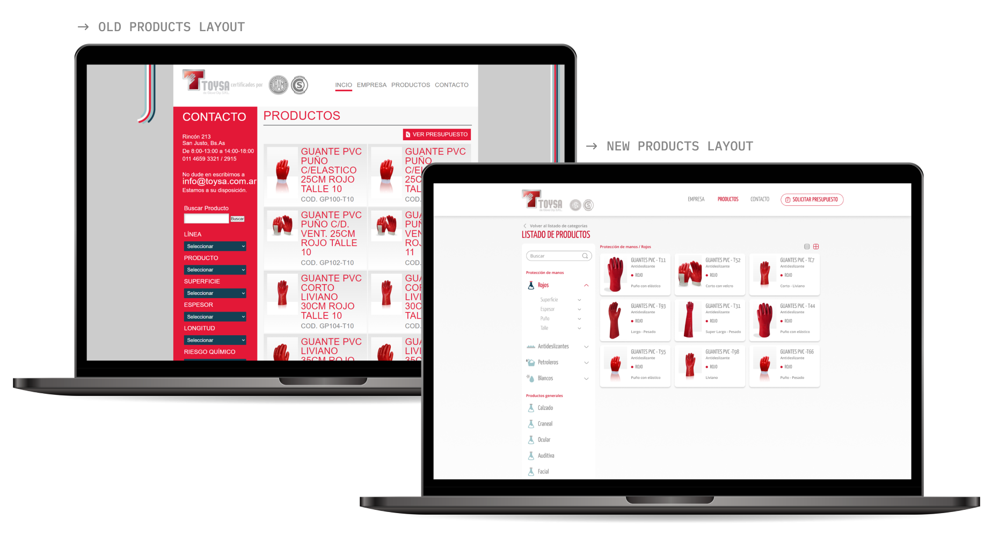

## 🗂 Project Overview

This project focused on the **redesign and improvement of the user experience** in Toysa’s e-commerce site, specifically the process of **requesting price quotes** for a wide range of products.
The main goal was to simplify navigation, clarify the purpose of the platform, and reduce friction in the quote request flow.

---

## 🌍 Context

Toysa offers a large catalog of products where customers **request price quotes** instead of purchasing directly online.
The site had usability and clarity issues, which negatively impacted both new and experienced users.

---

## 🎯 Challenge

- Make it clear that the site’s main purpose is **requesting quotes, not direct purchases**.
- Improve **product search** and **filter navigation**.
- Reduce **cognitive load** caused by repetition and excessive scrolling.
- Provide a **logical and scalable hierarchy** across all sections.

---

## 🔎 Research & Insights

I conducted a **heuristic evaluation** using **Nielsen’s 10 Heuristics** to identify usability issues across the platform.

### Key Insights:

- **Products section** was the most problematic area:
  - Filters had too many items → slowed down navigation.
  - Categories lacked clarity → difficult to scan simultaneously.
  - Product variations appeared repetitively → cluttered searches.
  - Long vertical format → excessive scrolling.
  - No clear entry point for new users requesting quotes.

- **Entire site**:
  - Buttons/texts were inconsistent, out of scale, and often truncated.
  - Lack of clear hierarchy between elements.
  - No guidance for first-time visitors.

- **From heuristics analysis**:
  - Missing **loading indicators** (visibility of system status).
  - Technical terms not familiar to new users (match with real world).
  - Long paths required for basic actions (user control & freedom).
  - Inconsistent button hierarchy (consistency & standards).
  - No undo actions for order changes (error prevention).
  - Overloaded with repetitive information (minimalist design).
  - No FAQs or help section (help & documentation).

👉 After discussing with the company, we prioritized **improvements in the products section** since it was the core of the user flow.

## 🛠 Design Approach

The redesign aimed to simplify the experience and reduce friction points, while ensuring scalability for the catalog.

### Key Priorities:

- 🔄 **Redesign the roadmap** for quote requests → fewer clicks & screens.
- 🧩 **Component revamp** → improved visual hierarchy and clarity.
- 🎛️ **Simplify product grid & filters** → reduce repetition and noise.
- 🚪 **Clear entry point** for new users → smoother onboarding.
- 📢 Emphasize the term **“PRESUPUESTO” (quote)** across flows.
- ✨ **Cleaner UI** → reduce information overload, improve readability.

## 📈 Results & Learnings

- Improved **efficiency** in requesting quotes → faster navigation and fewer steps.
- Better **clarity of primary actions** → reduced user confusion.
- A more **scalable and structured design system** for future iterations.
- Key learning: **even in B2B contexts, clarity and minimalism drive adoption**.

---

## 🔗 View more:

[Go to the Interactive Prototype](https://www.figma.com/proto/Y9YH0hgzLNGXdXKCKUpFUf/Toysa?node-id=2-2&p=f&t=dikI0bHYuLoN8gfG-1&scaling=min-zoom&content-scaling=fixed&page-id=0%3A1&starting-point-node-id=2%3A2&show-proto-sidebar=1)
